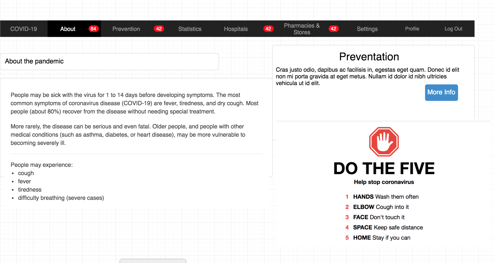
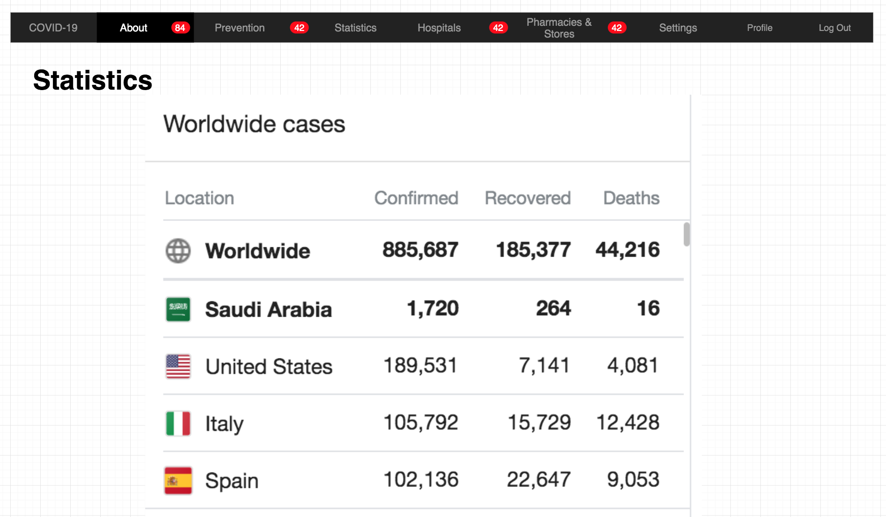
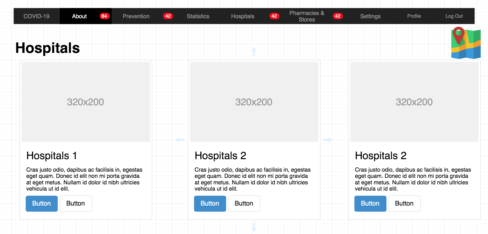
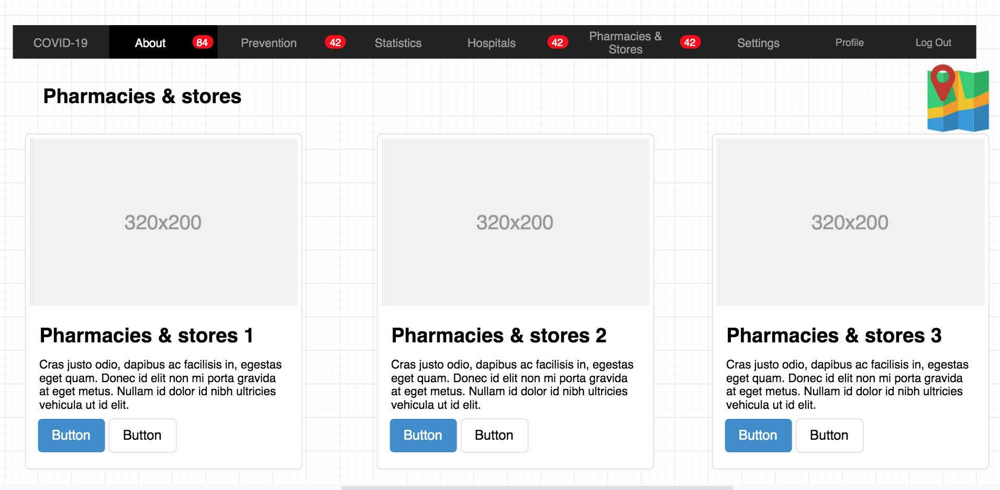
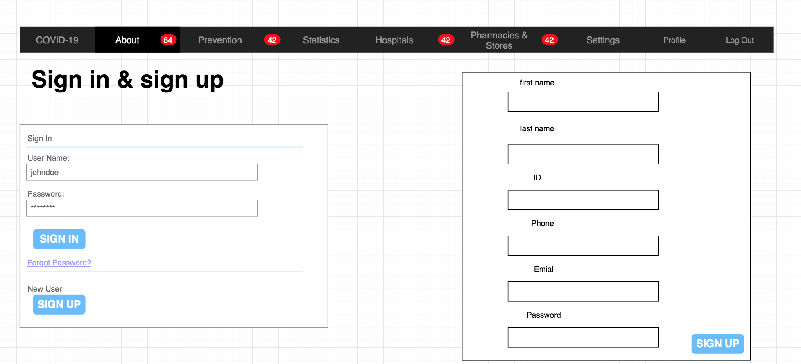
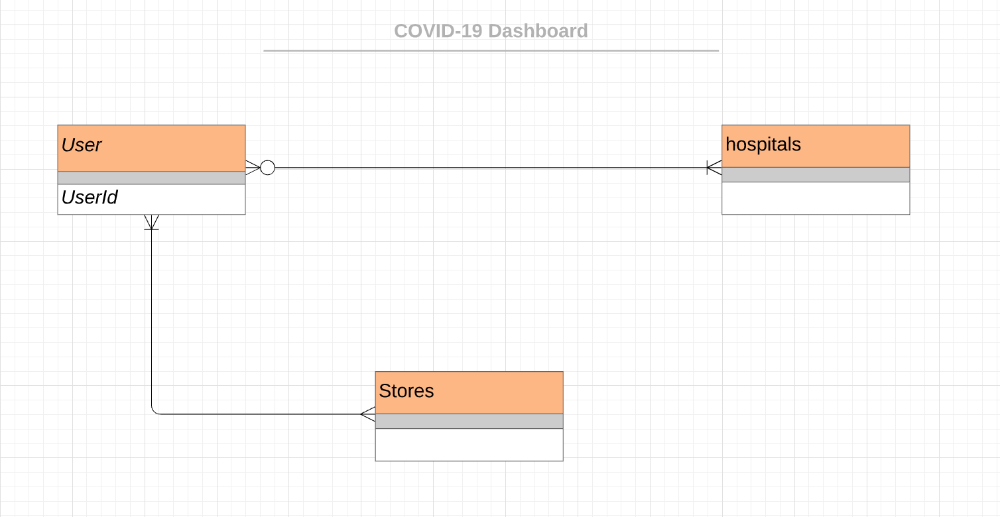

# COVID-19 Dashboard

## About The Project 

The project about a dashboard for COVID-19 where a user can learn more about the disease's statistics, symptoms , near by stores sell sanitizers, and proper hospitals
where a user can make an appointment for testing.

## Wireframes

## Entity–relationship model(ERD)

## User Stories
### VERSION 1.0
#### User Model
- As a new user,  I can sign up 
- As a user, I can sign in 
- As a user, I can see the feeds (statistics, info, advice) about COVID-19 
- As a user, I can see the Pharmacies that sell sanitizers, masks, and gloves near me 
- As a user, I can see hospitals accept COVID-19 patients near me 
- As a user, I can make an appointment to make a test for COVID-19 
- As a user, I can see info about the hospitals ( test price, accept insurance)

#### Gust Model:
- As a gust, I can see feeds about COVID-19 

#### Admin Model:
- As an admin, I can add feeds 

### VERSION 2.0
#### User Model:

- As a user, I can add my health status of COVID-19 ( negative, positive or suspected) 
- As a user, I can see if someone is positive or suspected for COVID-19 near me  
- As a user, I can notify if someone is positive or suspected for COVID-19 near me   

#### Admin Model:
- As an admin, I can track the movement of quarantined people 

